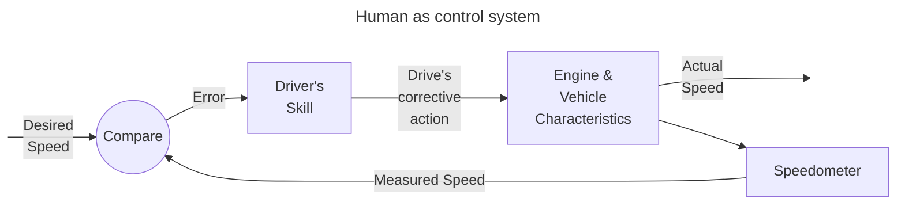
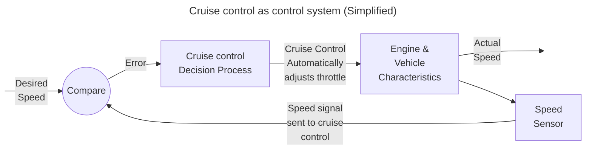

Broadly defined as:
> The comparison of a measured physical variable with the desired value of that variable with the aim of taking action to minimise the difference between the measured and desired values.
## Every day example
Imagine the task of a driver maintaining a constant speed while driving a car. This is an example of [[closed-loop control]].
The aspects of the system are:

- A speed is chosen by the driver. This is the [[Demand]] for the system.
- The current speed is measured by the speedometer, which is observed by the driver.
- The driver compares their desired speed to the speedometer and assesses the difference (Known as the [[Error]]).
- Equipped with the knowledge of driving, the driver makes a decision on how to correct the speed based on the value of the [[Error]], and an understanding of how well the speed is converging to the desired value.
- The driver attempts to correct the speed by raising or lowering their foot on the accelerator.
- Depending on factors such as the mass of the car, the power of the engine etc. The car will respond gradually. An experienced driver will rapidly converge on their desired value. An inexperienced driver will likely oscillate about the desired value.

This is also an example of [[Negative feedback]] because the driver will release the accelerator if they are going too fast and the same of the inverse. The action and the error are [[Inversely proportional]].

This process is optionally automated in most modern cars with a system called "Cruise control". Here is what the same [[Control Algorithm]] looks like with cruise control:

